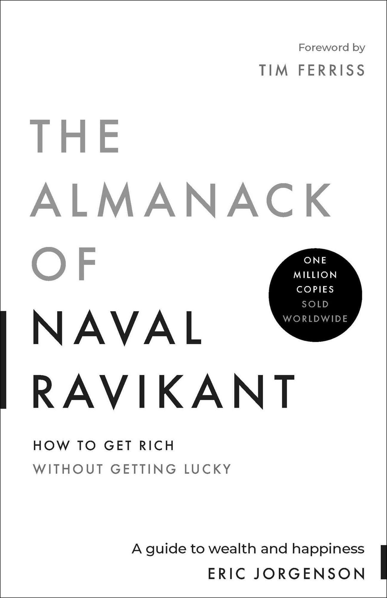

# Week 01 — Success Mindset (Mindset OS)

Part of the DevOps Micro Internship (DMI) with Agentic AI

---

## Purpose (Read This First)

This week is not motivation homework.

This is you building your **Mindset OS** — the system you will use for the next 5 months (and honestly, for years).

### Expectations

* Be honest.
* Be specific.
* Be practical.
* Write like an adult professional: clear sentences, no one-liners.

You will reuse this in later weeks. So do it properly once.

---

# Assignment 1. What is something you believe to be true that most people around you would disagree with?

### Rules

* No "safe" answers.
* Must be your real belief (not copied from internet).
* Minimum 50 words.

**Hint:** What do you believe about career, money, learning, discipline, relationships, health, success, life, tech industry, etc. that most people don't agree with?

## Answer

Practice makes a man perfect they say, yet the sentence is not true as it's not complete. Only with the right practice will a man become perfect. Hardwork won't lead a man to success if the efforts are futile.

---

# Assignment 2. What are the top 3 objective truths you discovered through experimentation and results?

### Definition

Objective truths do not depend on opinions. They hold true regardless of how people feel.

Write each truth in this format:

**Truth:** (1 sentence)

**Evidence from my life:** (2–4 lines: what you tried + what happened)

---

## Truth #1

### Truth

Others can cloud your judgement about people pretty easily, if you're not careful.

### Evidence from my life

Good people and relations walked out of life when I turned off my senses and ignored them, because I let people's opinion pollute my mind. 

---

## Truth #2

### Truth

People wake up with different feelings everyday.

### Evidence from my life

A movie might give you motivation for a week. A compliment, for a day. It will wear off gradually. Hence don't work making motivation as your basis. Become disciplined. 

---

## Truth #3

### Truth

"Jo dikhta hai, wahi bikta hai." which translates to - Publicity sells.

### Evidence from my life

Be as good as you can in real life but if you don't show your work, someone else will be there who will get all the laurel even with talents not more than yours.

---

# Assignment 3. What does your 2.0 version look like?

### Instructions

Write as if a journalist is writing about you **3 to 7 years from now** (not 20 years).

**Minimum 300 words.**

### Rules

* Write in past tense, like it already happened.
* Don't use "likes to / wants to / hopes to."
* Use specifics:

  * built
  * shipped
  * led
  * published
  * earned
  * relocated
  * contributed
* Include skills proof:

  * projects
  * portfolios
  * GitHub
  * blogs
  * certifications
  * job role
  * leadership
  * community contribution
* Add 1–3 images if you can (optional but powerful).

### Publish It Publicly On Any ONE

* LinkedIn
* Medium
* WordPress
* Blogspot
* Personal blog
* Portfolio page

Use the credit note that matches your track:

Add the following credit note at the end of your post **(If you are DMI Cohort 3 student)**:

> **P.S. This post is part of the DevOps Micro Internship (DMI) with Agentic AI — Cohort 3 — by [Pravin Mishra](https://www.linkedin.com/in/pravin-mishra-aws-trainer/). My graded progress is public: https://dmi.pravinmishra.com/s/YOUR-GITHUB-USERNAME.html · Start your DevOps journey: https://dmi.pravinmishra.com/?utm_source=student&utm_medium=ps-blog&utm_campaign=cohort3**

**Tag [Pravin Mishra](https://www.linkedin.com/in/pravin-mishra-aws-trainer/) in your LinkedIn post, then tag Lead Co-Mentor — [Anjana Muthunayake](https://www.linkedin.com/in/anjana-muthunayake/).**

Add the following credit note at the end of your post **(If you are DMI Self-paced track student)**:

> **P.S. This post is part of the DevOps Micro Internship (DMI) — Self-Paced Engineer Track — by [Pravin Mishra](https://www.linkedin.com/in/pravin-mishra-aws-trainer/). My graded progress is public: https://dmi.pravinmishra.com/s/YOUR-GITHUB-USERNAME.html · Start your DevOps journey: https://dmi.pravinmishra.com/?utm_source=student&utm_medium=ps-blog&utm_campaign=self-paced**

Add the following credit note at the end of your post **(If you are DMI Campus student)**:

> **P.S. This post is part of the DevOps Micro Internship (DMI) — Campus — by [Pravin Mishra](https://www.linkedin.com/in/pravin-mishra-aws-trainer/). My graded progress is public: https://dmi.pravinmishra.com/s/YOUR-GITHUB-USERNAME.html · Start your DevOps journey: https://dmi.pravinmishra.com/?utm_source=student&utm_medium=ps-blog&utm_campaign=campus**

**Tag [Pravin Mishra](https://www.linkedin.com/in/pravin-mishra-aws-trainer/) in your LinkedIn post, then tag Lead Co-Mentor — [Anjana Muthunayake](https://www.linkedin.com/in/anjana-muthunayake/).**

Hashtags:

#DMIByPravinMishra #AgenticAI #DevOps

## Your Article

From Student Developer to AI Systems Engineer

By 2031, Saayan Chowdhury wasn't just someone who had learned how technology works. He was an engineer known for building AI-powered systems that actually ran in production and held up under real usage.

It started with curiosity — programming, AI, the mechanics of large software systems. At D.I.A.T.M. Rajbandh, that curiosity turned into projects that went past the scope of any assignment. Flying Eye, his autonomous drone-based detection and remote-sensing system, earned his team runner-up at the **Smart India Hackathon 2024 Grand Finale.** That result set the tone for how he'd approach engineering from then on: build things that solve real problems, not things that just look good in a demo.

The years after that expanded what he could do. **ResearchOS** was one such project that showed he could work across FastAPI, React and semantic search. Whereas **MailOverTel** combined Telegram, Gmail SMTP, Docker and locally hosted AI models into a working email-automation system. His GitHub stopped looking like a folder of coursework and started looking like a record of shipped, documented, deployable work.

By 2031 he was working as an AI Systems Engineer — wiring AI into backend services, APIs, cloud infrastructure and automation pipelines. The systems he had built carried real traffic, not just test data. His grounding in Docker and DevOps meant his job didn't stop at writing code: deployment, monitoring, CI/CD, uptime — all of it was his to own.

That growth showed up publicly too. He wrote about AI systems, architecture, and DevOps in a way that made dense material readable for someone just starting out. His repositories weren't side projects anymore — they were part of how people recognized his work.

He had also stopped being a solo contributor. He led small teams on AI automation and infrastructure work, reviewed code, made architecture calls and helped newer engineers move past tutorials into building things that shipped. He showed up in developer communities, passed on what he had learned to students starting where he once did and backed his hands-on experience with cloud, DevOps and AI certifications — not as a substitute for the work, but as proof alongside it.

The real shift in Saayan 2.0 wasn't a title or a tech stack. It was that he had stopped learning technologies in isolation and started engineering systems that connected. The student who used to ask how something worked was now the one deciding how the pieces fit together.

By 2031, the story was consistent across everything he had put out. He hadn't just prepared to become an engineer. He had become one — with AI, software systems and DevOps at the center of it.

### Public Link

Paste your link here:

`https://medium.com/@saayan.elite50/from-student-developer-to-ai-systems-engineer-f3a2b4932071`

---

# Assignment 4. Have you ever cut corners (unethical / dishonest / shortcut behavior — not necessarily illegal)? If yes, how did it make you feel?

### Important

You don't need to write the full story.

Focus on the feeling:

* guilt
* fear
* shame
* stress
* regret
* numbness
* etc.

This is about self-awareness, not judgment.

### Answer Format

**Yes / No**

If Yes:

**What emotion did you feel?** (minimum 50–100 words)

## Answer

Yes.

There have been times I took shortcuts, especially when I was under pressure to finish an academic task or project quickly. Even when the shortcut got the work done, I never felt fully satisfied with it. Usually there was a mix of guilt and stress, because I knew I'd focused more on getting the result than on actually understanding or doing things properly. It made me realize that shortcuts save time in the moment, but they leave you with a feeling that you didn't really earn the outcome. That feeling is what pushed me to value actually learning and building things myself.

---

# Assignment 5. What are 10 non-fiction books you plan to read in the next 1 year?

### Rules

* Mention **Title + Author**
* Any language allowed
* No fiction novels

### Tip

Choose books that improve:

* mindset
* communication
* productivity
* health
* money
* career
* leadership

## Book List

1. How to Win Friends and Influence People — Dale Carnegie

2. Atomic Habits — James Clear

3. The 7 Habits of Highly Effective People — Stephen R. Covey

4. Deep Work — Cal Newport

5. Make It Stick — Peter C. Brown

6. The Obstacle Is the Way — Ryan Holiday

7. The Comfort Crisis — Michael Easter

8. The Personal MBA — Josh Kaufman

9. The Psychology of Money — Morgan Housel

10. The Almanack of Naval Ravikant — Eric Jorgenson

---

# Assignment 6. What are the things you will measure regularly in your life and career?

### Rules

List topics only. No need to share numbers.

### Must Include

* Learning / skill
* Output / proof
* Health / energy
* Time / focus
* Money / finance (personal or business)

### Example

* Learning hours per week
* Deep work sessions per week
* Projects shipped / documented
* Steps / workouts
* Sleep hours
* Spending tracker

## My Metrics

* New technical skills learned and practiced each week
* Personal projects completed and documented
* Consistency in achieving my weekly goals and personal commitments
* Time spent learning DevOps, Cloud Computing, and AI
* Physical health, sleep, exercise, and overall energy
* Quality of my relationships and professional network
* Quality of my focus and time management
* Quality of my mindset to counter setbacks
* Quality of soft skills and clear communication
* Progress toward achieving my Computer Science degree

---

# Assignment 7. Brain Dump + 5-Month System Plan

## Step 1: Brain Dump (Private)

Do a brain dump of everything in your mind into a notebook.

Examples:

* Bills
* Tasks
* Worries
* Goals
* Pending messages
* Ideas
* Responsibilities

### Did You Do It?

**Yes / No**

Answer:

Yes

---

## Step 2: Your 5-Month Routine + Focus Blocks

Create a simple plan you can realistically follow for the next 5 months.

### Weekly Routine

Example:

* Mon–Thu: 60 min deep work
* Sat: DMI session
* Sun: Weekly review

#### My Weekly Routine

Monday–Thursday: 60 min deep work

9:00–10:00 PM

Focus on one primary technical track at a time:

AI systems
Backend/API engineering
Docker/DevOps
Projects

Rule: Build > watch tutorials.
If you need to learn something, learn it only because the current task requires it.

Friday: 30–45 min — Communication

9:00–9:45 PM

Alternate between:

Writing a technical explanation
Improving your LinkedIn/GitHub presence
Reading aloud / explaining a technical concept
Documenting something you've built

The goal is to become someone who can explain engineering clearly, not just do it.

Saturday: 1.5–2 hr — DMI + Project

Flexible, preferably afternoon/evening

1 hr: DMI work
30–60 min: Apply what you learned to your own project.

Don't let DMI become something you complete only for the certificate. Extract something useful from every session and put it into your actual engineering work.

Sunday: 30 min — Weekly Review

8:00–8:30 PM

Answer only these:

1. What did I actually build this week?

2. What did I learn that I can demonstrate?

3. Where did I waste time?

4. What is the ONE thing that matters next week?

Then schedule that week's four deep-work sessions.

---

### Focus Blocks

#### When Will You Do DMI Work? (Days + Time)

Everyday for 3 hours excluding live sessions and class

#### How Many Sessions Per Week?

I will literally commit part of every single day to DMI work. At least a session every day.

---

### Distraction Rules

Examples:

* Phone rules
* Social media rules
* Environment setup

#### My Distraction Rules

* Discipline: Prioritize long-term goals over temporary comfort or distractions.
* Accountability: Review my daily goals at the start of each day and track whether I completed them.
* Entertainment: Reserve movies, gaming and other high-dopamine activities for scheduled rest periods.
* Social Media: Use social media only for learning, networking or publishing content.

---

# Reflection – Week 1

### Biggest insight I got about myself this week

I don't have an information problem. I have an execution problem.

I keep looking for better systems, better tools, better projects and better ways to learn. That's useful up to a point but it can also become a sophisticated form of procrastination. I already know enough to make meaningful progress. What I need now is to stop constantly optimizing the plan and start consistently doing the work.

My potential doesn't matter much if my daily actions don't match it.

### My biggest weakness/loop I noticed

I get excited by ambitious ideas and then spread my attention across too many things.

I can understand something quickly and even make a good plan for it but maintaining boring consistent effort is harder. I tend to chase novelty and complexity instead of repeatedly doing the fundamentals that actually compound.

The uncomfortable truth is that I sometimes mistake thinking about becoming capable for becoming capable.

### One system I will implement from this week (exact habit + time)

Every day before going to bed, I will do a 30-minute execution review.

20 minutes: work on the single most important skill/project I am currently pursuing — no tutorials unless absolutely necessary.

5 minutes: write what I actually accomplished, not what I intended to accomplish.

5 minutes: decide tomorrow's single most important task and write the exact first action required to start it.

### LinkedIn Post

Paste your LinkedIn post link here:

`https://www.linkedin.com/posts/saayan-chowdhury-pop2004_ai-aiengineering-softwareengineering-activity-7504551097332723712-Yth3?utm_source=share&utm_medium=member_desktop&rcm=ACoAAFKNFu0BzZBIwP_0LZpQ5nnIuLGv6FIOItw`

---

## 10. Proof of Work

- LinkedIn Post URL: **[Saayan Chowdhury](https://www.linkedin.com/posts/saayan-chowdhury-pop2004_ai-aiengineering-softwareengineering-activity-7504551097332723712-Yth3?utm_source=share&utm_medium=member_desktop&rcm=ACoAAFKNFu0BzZBIwP_0LZpQ5nnIuLGv6FIOItw)**  
- Blog / Medium : **[Saayan Chowdhury](https://medium.com/@saayanchowdhury/from-student-developer-to-ai-systems-engineer-f3a2b4932071?sharedUserId=saayanchowdhury)**  

---

## 📌 About DMI & CloudAdvisory

DevOps Micro Internship (DMI) is a project-based DevOps program run by Pravin Mishra (The CloudAdvisory) focused on real-world execution, systems thinking, and career readiness.

It helps learners build strong DevOps foundations with hands-on experience.

## 📌 Resources

- 🌐 **DMI Official Website:** https://dmi.pravinmishra.com?utm_source=github&utm_medium=readme  
- 🎓 **University:** https://university.pravinmishra.com?utm_source=github&utm_medium=readme  
- 💬 **Discord Community:** https://discord.pravinmishra.com?utm_source=github&utm_medium=readme  
- 📝 **Blog:** https://dmi.pravinmishra.com/blog?utm_source=github&utm_medium=readme  
- ▶️ **YouTube Playlist (DMI Cohort 3):** https://www.youtube.com/playlist?list=PLFeSNDtI4Cho  
- 🔗 **Pravin Mishra (LinkedIn):** https://www.linkedin.com/in/pravin-mishra-aws-trainer/  
- 🏢 **CloudAdvisory (LinkedIn):** https://www.linkedin.com/company/thecloudadvisory/

---

*This submission is part of DevOps Micro Internship (DMI) — Agentic AI Track*