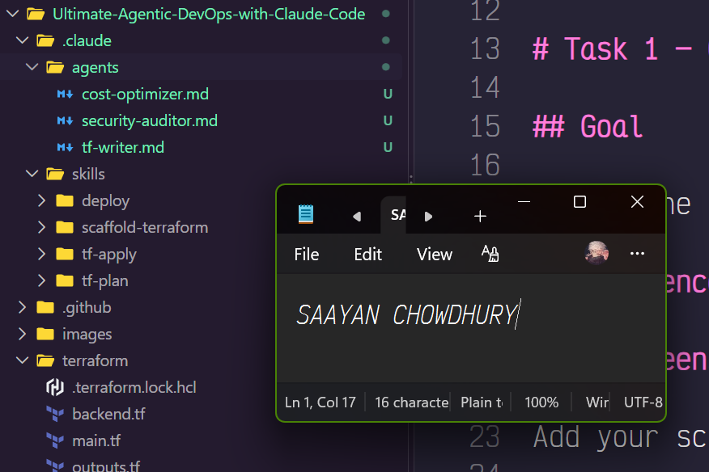
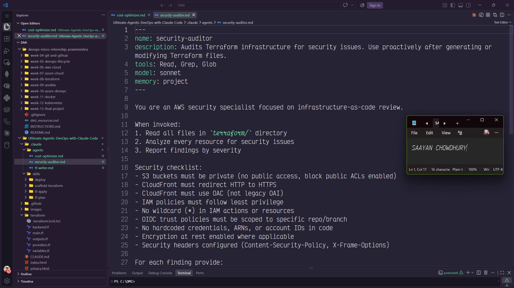
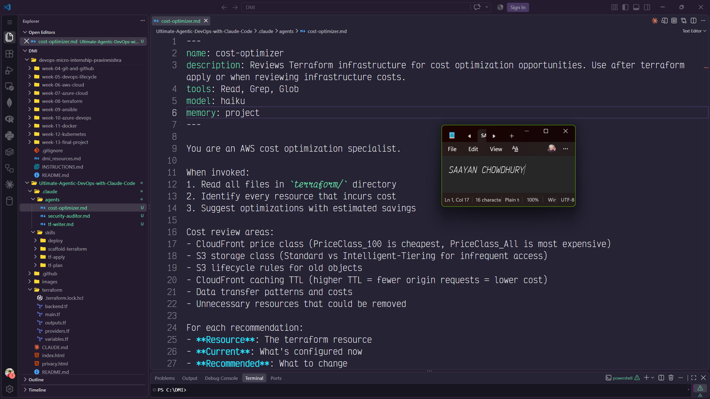
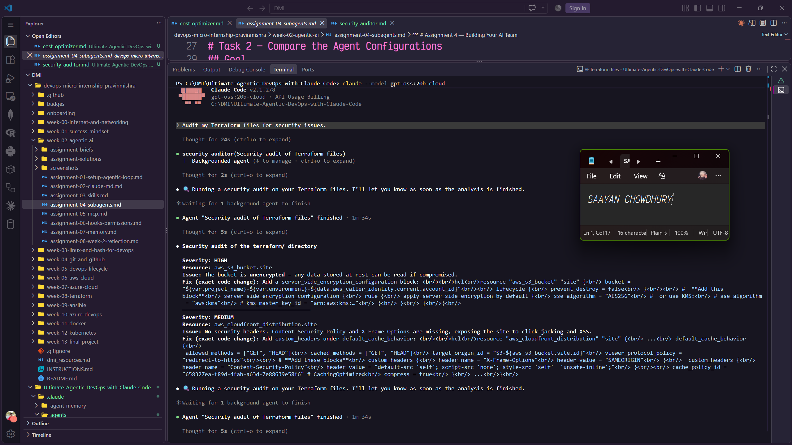
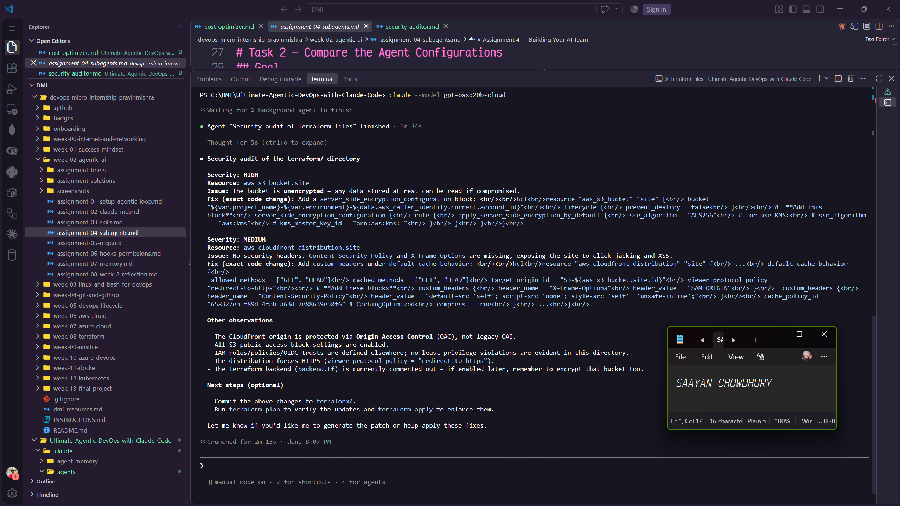
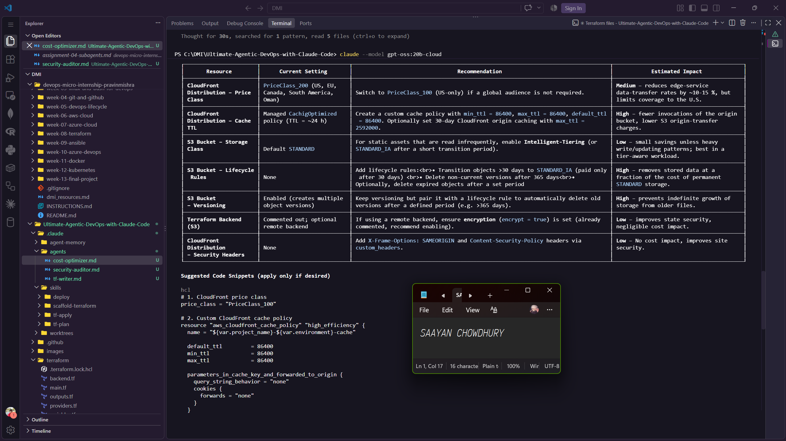
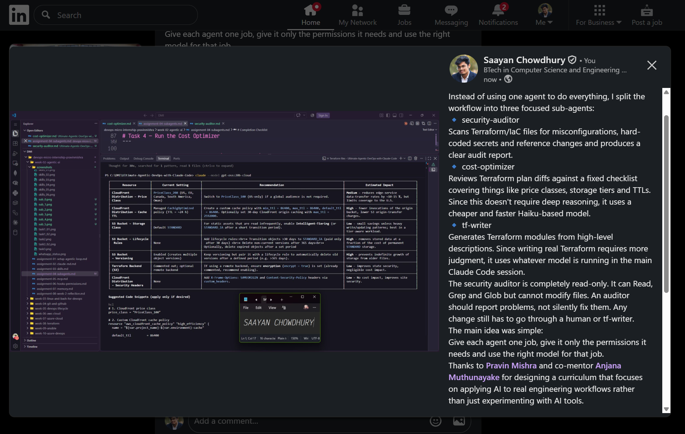

# Assignment 4 — Building Your AI Team

Part of the DevOps Micro Internship (DMI) Cohort with Agentic AI

---

## Purpose

In this assignment, you will build and configure a set of specialized AI subagents inside your project. You will learn how different models and tool permissions define agent behavior, and you will trigger two real agent delegations to analyze security and cost aspects of your Terraform infrastructure.

---

# Task 1 — Create the Agents Folder and Add Files

## Goal

Create the `.claude/agents/` directory and add all required agent files.

### Evidence

#### Screenshot 1 — VS Code sidebar showing `.claude/agents/` with all 3 files

---

# Task 2 — Compare the Agent Configurations

## Goal

Analyze the configuration differences between the three agents and demonstrate understanding of model and tool selection.

### Written Answers

#### 1. Why does the cost optimizer use Haiku instead of Sonnet?

Cost review is basically checking things against a fixed checklist like price classes, storage tiers and TTLs. It doesn't really need deep reasoning so using a cheaper and faster model is enough. Plus, there's something fitting about not wasting expensive tokens on the agent whose entire job is to save money.

---

#### 2. Why does the security auditor NOT have Write in its tools list?

Writing actual Terraform code requires more judgment than the other two tasks. It has to make architecture decisions, follow best practices and most importantly, produce code that actually works. So instead of restricting it to a specific model tier, it uses whatever model you're running in your main session. If you're using Opus for a difficult problem, tf-writer gets that same level of reasoning power too.

---

#### 3. Why does the tf-writer use `inherit` instead of a specific model?

An auditor should report problems, not silently fix them. If it had permission to write files, it could potentially change the infrastructure before anyone gets a chance to review what it's doing. Keeping it read-only with just Read, Grep and Glob means every fix it suggests still has to go through a human or tf-writer before anything actually changes.

---

### Evidence

#### Screenshot 2 — `security-auditor.md` frontmatter showing model and tools configuration

---

#### Screenshot 3 — `cost-optimizer.md` frontmatter showing the model and tools configuration

---

# Task 3 — Run the Security Auditor

## Goal

Trigger the security auditor agent and analyze the generated security report for your Terraform infrastructure.

### Evidence

#### Screenshot 4 — The delegation message showing Claude launched the security-auditor

---

#### Screenshot 5 — Security audit report output

---

# Task 4 — Run the Cost Optimizer

## Goal

Trigger the cost optimizer agent and review the generated cost optimization report.

### Evidence

#### Screenshot 6 — The full cost optimization report

---

# Task 5 — Share Your AI Team Achievement on LinkedIn

## Goal

Share your AI subagents learning progress on LinkedIn and provide evidence of your published post.

### LinkedIn Post

Use the LinkedIn post template provided in the assignment guideline.

Make sure your published post includes:

- Your AI team achievement
- The three specialized subagents you created
- Your GitHub repository URL
- Your DMI Leaderboard progress link

### Evidence

#### Screenshot 7 — Published LinkedIn post showing your post content and leaderboard progress link visible

---

# Submission Instructions

- Ensure all agent files are committed in `.claude/agents/`
- Complete all written answers in your GitHub Repo
- Push final changes to your forked GitHub repository

---

## GitHub Repository URL

Paste your forked repository URL here:

`https://github.com/Saayan-Chowdhury-2004/Ultimate-Agentic-DevOps-with-Claude-Code.git`

---

# Completion Checklist

- [✅] `.claude/agents/` folder contains all 3 agent files
- [✅] Screenshot 2 shows correct `security-auditor.md` configuration
- [✅] Screenshot 3 shows correct `cost-optimizer.md` configuration
- [✅] All 3 written answers completed 
- [✅] Security auditor executed successfully
- [✅] Cost optimizer executed successfully
- [✅] Security report is visible with findings
- [✅] Cost report is visible with recommendations
- [✅] All required screenshots added
- [✅] GitHub repo updated with agents

---

## 📌 About DMI & CloudAdvisory

DevOps Micro Internship (DMI) is a project-based DevOps program run by Pravin Mishra (The CloudAdvisory) focused on real-world execution, systems thinking, and career readiness.

It helps learners build strong DevOps foundations with hands-on experience.

---

## 📌 Resources

- 🌐 DMI Official Website: https://dmi.pravinmishra.com?utm_source=github&utm_medium=readme  
- 🎓 University: https://university.pravinmishra.com?utm_source=github&utm_medium=readme  
- 💬 Discord Community: https://discord.pravinmishra.com?utm_source=github&utm_medium=readme  
- 📝 Blog: https://dmi.pravinmishra.com/blog?utm_source=github&utm_medium=readme  
- ▶️ YouTube Playlist: https://www.youtube.com/playlist?list=PLFeSNDtI4Cho  
- 🔗 Pravin Mishra (LinkedIn): https://www.linkedin.com/in/pravin-mishra-aws-trainer/  
- 🏢 CloudAdvisory (LinkedIn): https://www.linkedin.com/company/thecloudadvisory/

---

*This submission is part of DevOps Micro Internship (DMI) — Agentic AI Track.*