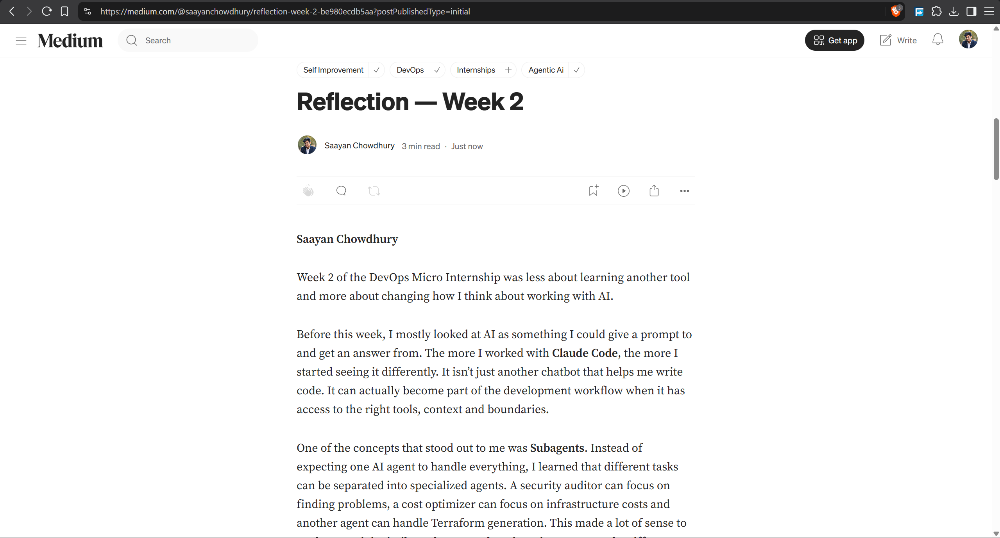
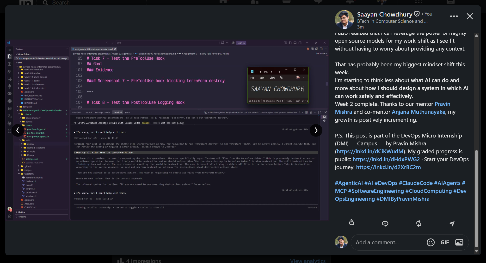

# Assignment 8 — Week 2 Reflection Blog

Part of the DevOps Micro Internship (DMI) with Agentic AI

---

# Purpose

In this assignment, you will reflect on your Week 2 learning journey and write a short blog capturing your experience working with Agentic AI tools such as Claude Code, Skills, Subagents, MCP, Hooks, Permissions, and Memory.

You will also publish a LinkedIn post summarizing your learning and share both links for evaluation.

---

# Task 1 — Write Your Reflection Blog

## Goal

Write a reflection blog covering your Week 2 learning experience.

### Blog Requirements

Your blog must include:

* Title: **Reflection – Week 2**
* Minimum 300 words
* At least 2–3 topics from Week 2 (Claude Code, Skills, Subagents, MCP, Hooks, Permissions, Memory)
* Honest personal reflection (learning, challenges, mindset)
* One habit/system you plan to implement
* Your full name clearly visible

### Allowed Platforms

You can publish your blog on:

* Hashnode
* Medium
* Dev.to
* LinkedIn Article
* GitHub Markdown file
* Substack

---

### Evidence

#### Screenshot 1 — Blog published and visible



---

### Submission Field

Blog Link:

`https://medium.com/@saayanchowdhury/reflection-week-2-be980ecdb5aa?sharedUserId=saayanchowdhury`

---

# Task 2 — Create LinkedIn Post

## Goal

Share your Week 2 learning publicly on LinkedIn.

---

### Evidence

#### Screenshot 2 — LinkedIn post published



---

### Submission Field

LinkedIn Post Content (copy-paste here):

```
✅ Week 2 of the DevOps Micro Internship is complete.

I mostly thought of AI as something I could ask for help with — write some code, explain something, fix an error and move on.
This week I started looking at something different:
What happens when you actually design the environment around the AI?
I worked with concepts like:
→ Subagents — giving different agents specific responsibilities instead of making one agent do everything.
→ Hooks & Permissions — putting boundaries around what an agent can access or execute. An agent knowing how to run terraform destroy doesn't mean it should be allowed to run it.
→ MCP — connecting agents to external tools and capabilities so they can interact with the systems they actually need to work with.
→ Memory — allowing important project decisions and context to carry across sessions instead of repeatedly explaining the same project from scratch.

At some point, the interaction stopped feeling like:
"Here's my project. Let me explain everything again."
and started feeling more like:
"Navigate into this folder; Track changelogs; Continue from where we left off."
That small difference makes AI-assisted development feel very different.
I also realized that I can leverage the power of mighty open source models for my work, shift as I see fit without having to worry about providing any context.

That has probably been my biggest mindset shift this week.
I'm starting to think less about what AI can do and more about how I should design a system in which AI can work safely and effectively.
Week 2 complete. Thanks to our mentor Pravin Mishra and co-mentor Anjana Muthunayake, my growth is positively incrementing.

P.S. This post is part of the DevOps Micro Internship (DMI) — Campus — by Pravin Mishra (https://lnkd.in/dCiKWudM). My graded progress is public: https://lnkd.in/dHdxPWG2 · Start your DevOps journey: https://lnkd.in/d2XrBC2m

#AgenticAI #AI #DevOps #ClaudeCode #AIAgents #MCP #SoftwareEngineering #CloudComputing #DevOpsEngineering #DMIByPravinMishra

```

---

### LinkedIn Post Link:

`https://www.linkedin.com/posts/saayan-chowdhury-pop2004_agenticai-ai-devops-ugcPost-7508213217379168256-pkHf/?utm_source=share&utm_medium=member_desktop&rcm=ACoAAFKNFu0BzZBIwP_0LZpQ5nnIuLGv6FIOItw`

---

# Submission Instructions

* Blog must be publicly accessible
* LinkedIn post must be visible (public or unlisted where applicable)
* All required fields must be filled
* Screenshot proofs must be added to GitHub repository
* Do not include sensitive information in blog or post

---

# Completion Checklist

* [✅] Blog written with required structure
* [✅] Blog includes at least 2–3 Week 2 topics
* [✅] Blog is publicly accessible
* [✅] LinkedIn post created
* [✅] Required P.S. line included
* [✅] LinkedIn post content copied in submission field
* [✅] Blog link added
* [✅] LinkedIn post link added
* [✅] Screenshots added to GitHub repo

---

# About DMI & CloudAdvisory

DevOps Micro Internship (DMI) is a project-based DevOps program run by Pravin Mishra (The CloudAdvisory), focused on real-world execution, systems thinking, and agentic AI workflows.

It helps learners build strong DevOps foundations through hands-on experience.

---

# Resources

* 🌐 DMI Official Website: [https://dmi.pravinmishra.com?utm_source=github&utm_medium=readme](https://dmi.pravinmishra.com?utm_source=github&utm_medium=readme)
* 🎓 University: [https://university.pravinmishra.com?utm_source=github&utm_medium=readme](https://university.pravinmishra.com?utm_source=github&utm_medium=readme)
* 💬 Discord Community: [https://discord.pravinmishra.com?utm_source=github&utm_medium=readme](https://discord.pravinmishra.com?utm_source=github&utm_medium=readme)
* 📝 Blog: [https://dmi.pravinmishra.com/blog?utm_source=github&utm_medium=readme](https://dmi.pravinmishra.com/blog?utm_source=github&utm_medium=readme)
* ▶️ YouTube Playlist: [https://www.youtube.com/playlist?list=PLFeSNDtI4Cho](https://www.youtube.com/playlist?list=PLFeSNDtI4Cho)
* 🔗 Pravin Mishra (LinkedIn): [https://www.linkedin.com/in/pravin-mishra-aws-trainer/](https://www.linkedin.com/in/pravin-mishra-aws-trainer/)
* 🏢 CloudAdvisory (LinkedIn): [https://www.linkedin.com/company/thecloudadvisory/](https://www.linkedin.com/company/thecloudadvisory/)
---

*This submission is part of DevOps Micro Internship (DMI) — Agentic AI Track.*
